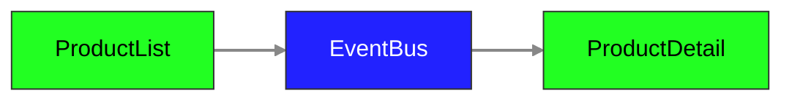

### Goal

Your goal is to finish the implementation of the feature.

You have two components: `ProductListComponent` and `ProductDetail` component.

Your team has decided to give the `EventBus` design pattern a go, they want to see it in action!

### Acceptance Criteria

At the very minimum you need to make sure that the automatic tests are passing, the pattern requirements are extra and will be evaluated separately.

#### Functionality

Your solution should be using the `EventBus` which has the following flow:



```gherkin
Scenario: Show product detail
    Given there are 3 products
    Then I should see 3 product cards
    When I click on the second card "Show more" button
    Then I should see the "Product 2" in the product detail's title
```
