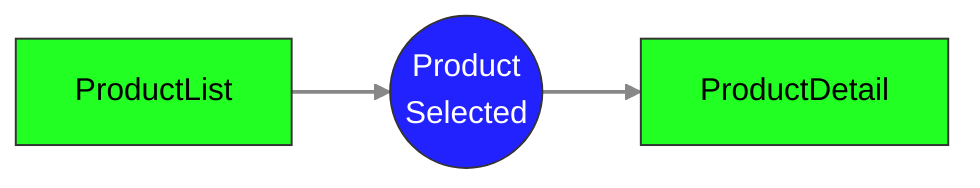

# Task: Product Selected

Make sure that two components can communicate between each other:

## Acceptence Criteria



`ProductListComponent` publishes `ProductSelected` event and `ProductDetailComponent` subscribes to it.

```gherkin
Feature: Product Cards

  Scenario: Show placeholder product
    Given there are 3 products
    Then I should see 3 product cards
    And I should see placeholder product in the product details

  Scenario: Show selected product
    Given there are 3 products
    When I click on the second card's "Show more" button
    Then I should see the selected product in the product details
```

This is a super quick overview of what needs to be done, however if you need more intro head into [Repo layout](#repo-layout) section below

## Quick Start

### Prerequisites

- Node.js ≥14
- (Optional) Angular CLI, if you want to run `ng serve` instead of `npm start`

### 1. Start the app

```bash
npm start
```

> By default it runs on `http://localhost:4200`. If you need a different host/port you need to [Setup different APP_URL](#setup-different-app_url)

### 2. Run the tests

```bash
npm test
```

> By default, this opens the Playwright Test Runner UI so you can click through scenarios.
> Need a different mode? See [Advanced Test Modes](#advanced-test-modes) below.

### 3. Push your solution

```bash
lg push
```

## Repo Layout

You’ll find:

- `src/app/` — your Angular starter code
  - `src/app/products` - products module
    - `ProductListComponent` - displays product cards
    - `ProductDetailComponent` - shows selected or placeholder product
    - `ProductsService` - fetches from public/products.json
- `public` - static files like json response needed for application
- `.e2e/` — test-runner package.json & helpers
  - `.e2e/src/` - your E2E specs
- `package.json` — scripts: start, test, test:ci, test:headed
- `README.md` — this file

## Advanced topics

This section is designed to help you with more advanced setup and troubleshooting.

### Setup different APP_URL

Let's say that you have your app running on port **_3001_**, the before running the tests you should setup `APP_URL` env variable like this:

- macOS/Linux:

```bash
export APP_URL=http://localhost:3001
```

- Windows (PowerShell)

```bash
$env:APP_URL = 'http://localhost:3001'
```

### Advanced Test Modes

- Headless (CI-style)

```bash
npm run test:ci
```

- Headed browser (for debugging)

```bash
npm run test:headed
```
