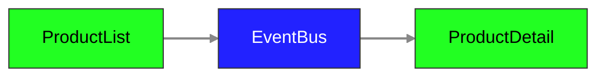

## Installation

Run `npm install` in order to install the app's dependencies

## Start the application

Then you can serve the app using `npm start`

## Run Tests

All the tests files are inside the `.e2e` folder.

In order to run the tests you can simply navigate in your terminal: `cd .e2e` from the root folder and then run one of the npm commands:

- `npm run test:ui` - will open up the playwright ui runner - **we recommend this option for better debugging**
- `npm run test` - will run all e2e tests one time in headless mode
- `npm run test:headed` - will run all e2e tests one time in headed mode

## Finish your solution

### Application Architecture

#### App Component (`app.component.ts`)

- **Purpose**: Main application container
- **Layout**: Uses Bootstrap classes for responsive design
  - Product list takes up the top row
  - Product detail takes up the remaining space with flex-grow
- **Standalone**: Yes, imports both child components directly

#### Product List Component (`product-list.component.ts`)

- **Purpose**: Displays a grid of product cards
- **Features**:
  - Uses `toSignal()` to convert HTTP observable to signal
  - Displays product image, name, price, and "Show more" button
  - Uses Bootstrap grid system (`col-md-4`)
- **Data**: Fetches products from `/products.json` via `ProductsService`
- **Current State**: "Show more" button has no functionality yet

#### Product Detail Component (`product-detail.component.ts`)

- **Purpose**: Shows detailed view of a selected product
- **Features**:
  - Displays product image, name, price, and description
  - Color picker for background customization
  - Fallback state when no product is selected
- **State Management**: Uses signals for `product` and `selectedColor`
- **Current State**: No product selection mechanism implemented

#### Products Service (`products.service.ts`)

- **Purpose**: Handles product data operations
- **Features**:
  - `getAll()`: Fetches all products from `/products.json`
  - `getById()`: Finds specific product by ID
- **Data Model**: `ProductModel` interface with id, name, description, price, and image
- **HTTP**: Uses Angular's HttpClient for API calls

### Goal

Your goal is to finish the implementation of the feature.

You have two components: `ProductListComponent` and `ProductDetail` component.

Your team has decided to give the `EventBus` design pattern a go, they want to see it in action!

#### Acceptance Criteria

At the very minimum you need to make sure that the automatic tests are passing, the pattern requirements are extra and will be evaluated separately.

##### Functionality

Your solution should be using the `EventBus` which has the following flow:



```gherkin
Scenario: Show product detail
    Given there are 3 products
    Then I should see 3 product cards
    When I click on the second card "Show more" button
    Then I should see the "Product 2" in the product detail's title
```

## Push the code

After the tests are passing locally and you are happy with the quality of your solution, please push the code using `lg push` command in your root folder.

This will:

- deploy your app to our hosting server
- create pipeline that will:
  - use your deployed app and run e2e tests on our end and generate the report for you
  - use your source code so you can request the review from our end
