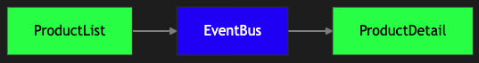

# Task: Product Selected

Make sure that two components can communicate between each other:

## Acceptence Criteria

Data flow is as following:



`ProductListComponent` publishes to `EventBus` and `ProductDetailComponent` subscribes to it.

### DONE tasks:

```gherkin
  Scenario: Show placeholder product
    Given there are 3 products
    Then I should see 3 product cards in product list
    And I should see "No products are selected" info text in the product details
```

---

### TODO Tasks:

```gherkin
  Scenario: Show selected product
    Given there are 3 products
    When I click on the second card's "Show more" button
    Then I should see the second product data in the product details
```

## Repo Layout

You’ll find:

- `src/app/` — your Angular starter code
  - `src/app/products` - products module
    - `ProductListComponent` - displays product cards
    - `ProductDetailComponent` - shows selected or placeholder product
    - `ProductsService` - fetches from public/products.json
- `public/products.json` - static json response needed for application
- `.e2e/` — playwright test-runner with more advanced README.md
  - `.e2e/src/` - your E2E specs

## Quick Start

### Prerequisites

- Node.js ≥22 because we are running Angular 20
- (Optional) Angular CLI, if you want to run `ng serve` instead of `npm start`

### 1. Start the app

```bash
npm start
```

> By default it runs on `http://localhost:4200`.
> Running on a different host/port? Checkout the README.md in .e2e folder

### 2. Run the tests

```bash
npm test
```

> By default, this runs tests in headless more in terminal.
> Need a different mode? Checkout the README.md in .e2e folder

### 3. Push your solution

```bash
npx @lowgular/cli@latest push
```

> By default it will run pre-push hook with test and if it passes, then it will push the solution and return the link to the academy
